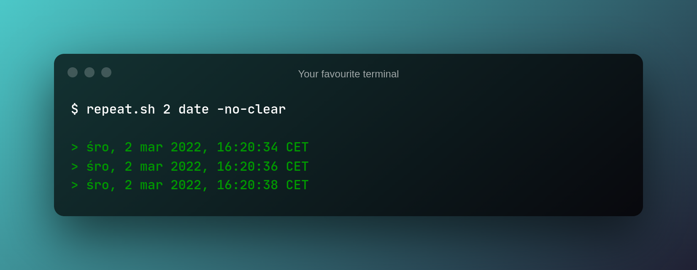

# `repeat-sh`
Repeat any shell command with interval

[](repeat.sh)

## Usage
```sh
./repeat.sh <interval in seconds> <command to run> [-no-clear]
```

By default your terminal is being cleared after given interval. You can turn clearing off by passing `-no-clear` option.

## License
GPLv2

## Author

Made in [Poland](https://en.wikipedia.org/wiki/Poland) in 2022 by [Jedrzej Pawel Maczan](https://maczan.pl/)